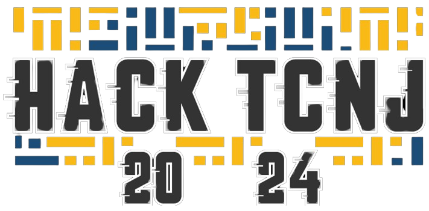

# HackTCNJ2024




SignWaver is a program that enables you to use gestures and voice commands to perform actions on your computer. This program is part of the HackTCNJ 2024 Event


## Authors:
Created by: Christopher Lam, Benjamin Guerrieri

## Usage:
To use, run the ____.py script

```
GESTURE MAPPING:

```